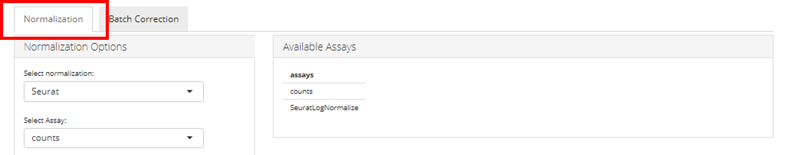
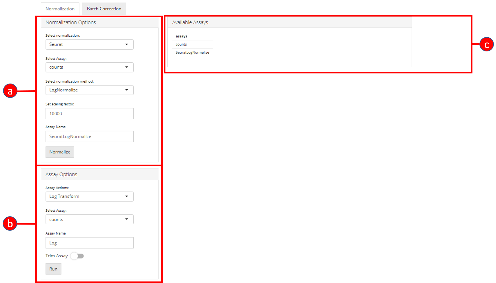

```{r develSetting, include=FALSE}
doEval = TRUE
```
## Introduction
Normalization of data in `singleCellTK` can be carried out either through a manually implemented `CPM` (Counts Per Million) method or through one of the methods offered by [Seurat](https://satijalab.org/seurat/) ([Butler et al., Nature Biotechnology 2018](https://www.nature.com/articles/nbt.4096) & [Stuart*, Butler*, et al., Cell 2019](https://www.cell.com/cell/fulltext/S0092-8674(19)30559-8)). In addition to these normalization methods, users can perform other transformations on the data such as trimming and log transformation among others.

Normalization tab can be opened up by clicking on the 'Normalization & Batch Correction' from the top menu and further selecting the 'Normalization' sub-tab in the consequent window as shown below.




The 'Normalization' user-interface is divided into three parts, a) Normalization Options, b) Assay Options, and c) Available Assays.



## a) Normalization Options
In the 'Normalization Options', users can select a method for normalization either `CPM` or one of the methods from `Seurat` i.e. `LogNormalize`, `CLR` (Centered Log Ratio) or `RC` (Relative Counts). Users can also set a manual 'Scaling Factor' (numeric value multiplied by the data values) and specify the 'Assay Name' for the new `assay`. 


## b) Assay Options
In addition to the normalization methods, manually implemented transformation methods can be used to perform different transformations on the data. These transformations include `Log Transform`, `log1p` and standard `Z-score`. 


If trimming of an `assay` is required, 'Trim Assay' option can be enabled and lower/upper bound values can be set. The default value for upper and lower trim values is `10` and `-10` respectively.


## c) Available Assays
The currently available `assays` are listed in the 'Available Assays' window. Whenever a new `assay` is generated, the list is updated automatically.

